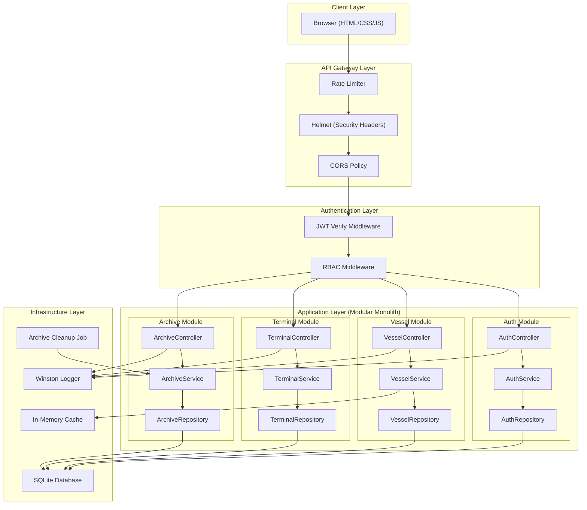
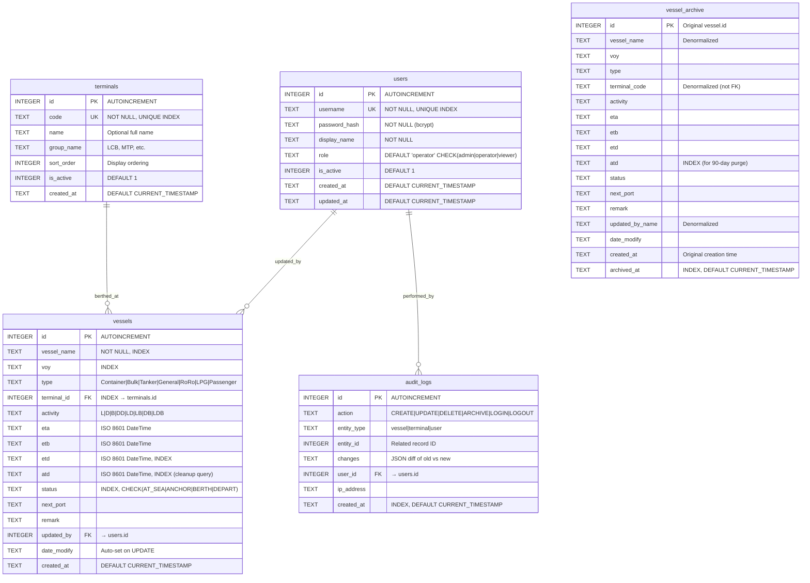
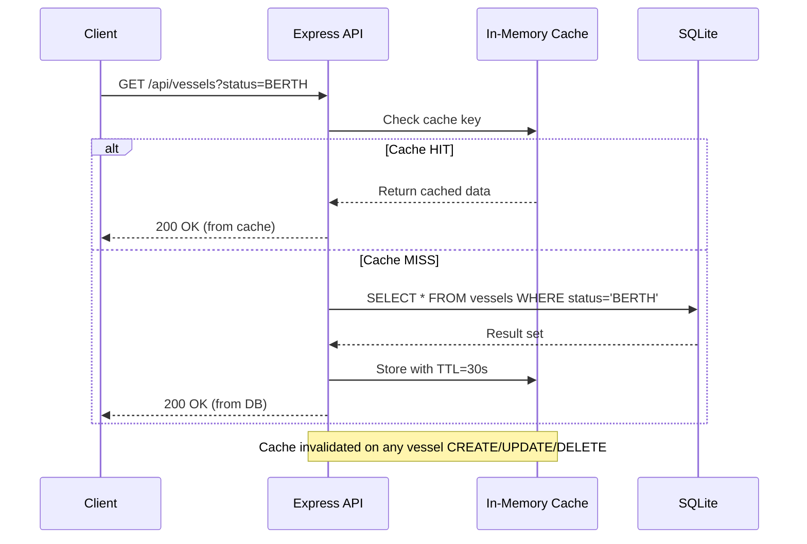
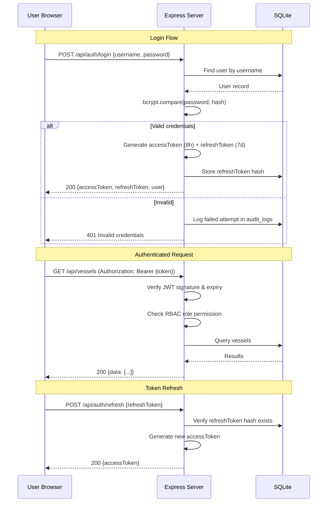

# Vessel Traffic Dashboard — Implementation Plan v3 (Enterprise-Grade)

ระบบ Dashboard สำหรับแสดงสถานะเรือเข้า-ออกท่าเรือ แบบ Airport FIDS
ออกแบบตามมาตรฐาน Enterprise Software Engineering 6 ด้าน

---

## 1. System Design & Architecture

### Architectural Pattern: Modular Monolith

เลือก **Modular Monolith** เพราะ:
- ขนาดโปรเจกต์เหมาะสม (ไม่ over-engineer เป็น Microservices)
- แยก Module ชัดเจน → อนาคตแตกเป็น Microservice ได้ง่าย
- Deploy เป็น container เดียว → ดูแลง่าย ลดต้นทุน



### Design Patterns Applied

| Pattern | Where | Purpose |
|---------|-------|---------|
| **Repository** | `*.repository.js` | แยก data access ออกจาก business logic — เปลี่ยน DB ได้โดยไม่กระทบ service |
| **Service Layer** | `*.service.js` | รวม business logic ไว้ที่เดียว — testable, reusable |
| **Controller** | `*.controller.js` | จัดการ HTTP request/response — แยกออกจาก logic |
| **Factory** | `errors.js` | สร้าง custom error objects ตามประเภท |
| **Strategy** | Sorting/Filtering | เปลี่ยน strategy การ sort/filter ได้ runtime |
| **Observer** | Archive Cleanup | Event-based trigger เมื่อ ATD > 24 ชม. |
| **Singleton** | Database Connection | Database connection instance เดียว |
| **Middleware Chain** | Express middleware | Chain of Responsibility สำหรับ request processing |

### Database Modeling & Optimization



**Indexing Strategy:**

```sql
-- Composite indexes for common query patterns
CREATE INDEX idx_vessels_status_terminal ON vessels(status, terminal_id);
CREATE INDEX idx_vessels_eta ON vessels(eta);
CREATE INDEX idx_vessels_atd ON vessels(atd);        -- Auto-archive query
CREATE INDEX idx_vessels_name ON vessels(vessel_name);-- Search
CREATE INDEX idx_archive_archived_at ON vessel_archive(archived_at);  -- Purge query
CREATE INDEX idx_audit_entity ON audit_logs(entity_type, entity_id);
CREATE INDEX idx_audit_created ON audit_logs(created_at);
```

> [!TIP]
> **Denormalization ใน `vessel_archive`**: เก็บ `terminal_code` และ `updated_by_name` เป็น text ตรงๆ แทน FK เพราะ:
> - Archive เป็น historical record → ข้อมูลต้องคงที่แม้ terminal/user ถูกลบ
> - ไม่ต้อง JOIN ตอน query archive → เร็วกว่า

---

## 2. Code Quality, Standards & Maintainability

### Project Structure (Clean Architecture)

```
vessel-dashboard/
├── .github/
│   └── workflows/
│       └── ci.yml                    # CI/CD Pipeline
├── docker-compose.yml                # Docker orchestration
├── Dockerfile                        # Multi-stage build
├── .env.example                      # Environment template
├── .gitignore
├── package.json
├── jest.config.js                    # Test configuration
│
├── src/
│   ├── index.js                      # Entry point (bootstrap)
│   ├── app.js                        # Express app factory
│   │
│   ├── config/
│   │   └── index.js                  # Centralized config (env vars)
│   │
│   ├── middleware/
│   │   ├── authenticate.js           # JWT token verification
│   │   ├── authorize.js              # RBAC role checking
│   │   ├── validate.js               # Zod schema validation
│   │   ├── rateLimiter.js            # Rate limiting per IP
│   │   ├── errorHandler.js           # Global error handler
│   │   └── requestLogger.js          # Structured request logging
│   │
│   ├── modules/
│   │   ├── auth/
│   │   │   ├── auth.controller.js    # HTTP layer
│   │   │   ├── auth.service.js       # Business logic
│   │   │   ├── auth.repository.js    # Data access
│   │   │   ├── auth.schema.js        # Zod validation schemas
│   │   │   └── auth.routes.js        # Route definitions
│   │   │
│   │   ├── vessel/
│   │   │   ├── vessel.controller.js
│   │   │   ├── vessel.service.js
│   │   │   ├── vessel.repository.js
│   │   │   ├── vessel.schema.js
│   │   │   └── vessel.routes.js
│   │   │
│   │   ├── terminal/
│   │   │   ├── terminal.controller.js
│   │   │   ├── terminal.service.js
│   │   │   ├── terminal.repository.js
│   │   │   ├── terminal.schema.js
│   │   │   └── terminal.routes.js
│   │   │
│   │   └── archive/
│   │       ├── archive.controller.js
│   │       ├── archive.service.js
│   │       ├── archive.repository.js
│   │       └── archive.routes.js
│   │
│   ├── jobs/
│   │   └── archiveCleanup.js         # Scheduled archive job
│   │
│   ├── database/
│   │   ├── connection.js             # Singleton DB connection
│   │   ├── migrations/
│   │   │   ├── runner.js             # Migration runner
│   │   │   ├── 001_initial_schema.js
│   │   │   └── 002_add_audit_logs.js
│   │   └── seeds/
│   │       ├── runner.js             # Seed runner
│   │       ├── 001_terminals.js      # 20 terminals
│   │       └── 002_admin_user.js     # Default admin
│   │
│   └── utils/
│       ├── logger.js                 # Winston structured logger
│       ├── errors.js                 # Custom error hierarchy
│       ├── response.js               # Standardized API response
│       └── pagination.js             # Cursor/offset pagination
│
├── tests/
│   ├── unit/
│   │   ├── auth.service.test.js
│   │   ├── vessel.service.test.js
│   │   ├── archive.service.test.js
│   │   └── pagination.test.js
│   ├── integration/
│   │   ├── auth.api.test.js
│   │   ├── vessel.api.test.js
│   │   ├── terminal.api.test.js
│   │   └── archive.api.test.js
│   └── helpers/
│       ├── setup.js                  # Test DB setup/teardown
│       └── factory.js                # Test data factory
│
├── public/                           # Static frontend
│   ├── index.html                    # Dashboard SPA
│   ├── login.html                    # Login page
│   ├── css/
│   │   └── style.css                 # FIDS dark theme
│   └── js/
│       ├── api.js                    # API client (fetch wrapper)
│       ├── app.js                    # Dashboard logic
│       ├── auth.js                   # Auth flow
│       ├── components.js             # UI components (modal, toast, table)
│       └── utils.js                  # Clock, CSV export, helpers
│
└── docs/
    └── openapi.yaml                  # OpenAPI 3.0 specification
```

### SOLID Principles Application

| Principle | Implementation |
|-----------|---------------|
| **S** — Single Responsibility | แต่ละไฟล์มีหน้าที่เดียว: Controller จัดการ HTTP, Service จัดการ logic, Repository จัดการ data |
| **O** — Open/Closed | เพิ่ม status ใหม่, activity ใหม่ ได้โดยไม่ต้องแก้ core logic (config-driven) |
| **L** — Liskov Substitution | Repository interface เหมือนกันทุก module → เปลี่ยน SQLite เป็น PostgreSQL ได้ |
| **I** — Interface Segregation | แต่ละ route file expose เฉพาะ endpoints ที่จำเป็น |
| **D** — Dependency Inversion | Service depend on Repository interface ไม่ใช่ concrete DB implementation |

### Standardized API Response Format

```javascript
// Success Response
{
  "success": true,
  "data": { ... },
  "meta": {
    "page": 1,
    "limit": 20,
    "total": 85,
    "totalPages": 5
  }
}

// Error Response
{
  "success": false,
  "error": {
    "code": "VALIDATION_ERROR",
    "message": "Invalid vessel data",
    "details": [
      { "field": "vessel_name", "message": "Vessel name is required" }
    ]
  }
}
```

### Custom Error Hierarchy

```javascript
// AppError (base)
//  ├── ValidationError (400)
//  ├── AuthenticationError (401)
//  ├── AuthorizationError (403)
//  ├── NotFoundError (404)
//  ├── ConflictError (409)
//  └── InternalError (500)
```

### Testing Strategy

| Level | Tool | Coverage Target | What to Test |
|-------|------|----------------|--------------|
| **Unit** | Jest | Service layer 90%+ | Business logic, validation, edge cases |
| **Integration** | Jest + Supertest | API endpoints 80%+ | Full request → response flow with test DB |
| **E2E** | Manual (Phase 1) | Critical paths | Login → CRUD → Archive → Export |

```javascript
// ตัวอย่าง Unit Test — vessel.service.test.js
describe('VesselService', () => {
  describe('getVessels()', () => {
    it('should return filtered vessels by status', async () => { ... });
    it('should apply pagination correctly', async () => { ... });
    it('should sort by ETA ascending by default', async () => { ... });
  });

  describe('createVessel()', () => {
    it('should set date_modify automatically', async () => { ... });
    it('should reject invalid terminal_id', async () => { ... });
    it('should create audit log entry', async () => { ... });
  });

  describe('archiveExpiredVessels()', () => {
    it('should archive vessels with ATD > 24 hours', async () => { ... });
    it('should not archive vessels without ATD', async () => { ... });
    it('should denormalize terminal_code and user_name', async () => { ... });
  });
});
```

### Database Migration System

```javascript
// migrations/001_initial_schema.js
module.exports = {
  version: 1,
  name: 'initial_schema',
  up(db) {
    db.exec(`CREATE TABLE IF NOT EXISTS users (...)`);
    db.exec(`CREATE TABLE IF NOT EXISTS terminals (...)`);
    db.exec(`CREATE TABLE IF NOT EXISTS vessels (...)`);
    db.exec(`CREATE TABLE IF NOT EXISTS vessel_archive (...)`);
  },
  down(db) {
    db.exec(`DROP TABLE IF EXISTS vessel_archive`);
    db.exec(`DROP TABLE IF EXISTS vessels`);
    db.exec(`DROP TABLE IF EXISTS terminals`);
    db.exec(`DROP TABLE IF EXISTS users`);
  }
};
```

> [!TIP]
> **Migration Runner** จะตรวจ `schema_migrations` table เพื่อดูว่า version ไหน run แล้ว → run เฉพาะ pending migrations เท่านั้น — ทำให้ schema evolution ปลอดภัย

---

## 3. Performance, Scalability & Resilience

### Caching Strategy: Cache-Aside with TTL



| Cache Key Pattern | TTL | Invalidation |
|-------------------|-----|--------------|
| `vessels:list:{hash(query)}` | 30 วินาที | On any vessel mutation |
| `vessels:summary` | 30 วินาที | On any vessel mutation |
| `terminals:list` | 5 นาที | On terminal mutation |
| `auth:user:{id}` | 2 นาที | On user update/delete |

> [!NOTE]
> ใช้ **In-Memory Cache** (node-cache) แทน Redis เพราะ:
> - Single instance → ไม่ต้องการ distributed cache
> - ลดค่าใช้จ่ายและ complexity
> - ถ้า scale up ในอนาคต → เปลี่ยนเป็น Redis ได้ง่าย (same interface)

### Performance Optimizations

| Optimization | Implementation |
|-------------|----------------|
| **Prepared Statements** | SQLite prepared statements สำหรับ queries ที่ใช้บ่อย → ลด parse time |
| **Pagination** | Offset-based pagination (20 rows/page) → ไม่ load ข้อมูลทั้งหมด |
| **Debounced Search** | Frontend debounce 300ms → ลด API calls |
| **Gzip Compression** | Express compression middleware → ลด payload size |
| **Static File Caching** | `Cache-Control` headers สำหรับ CSS/JS → ลด server load |
| **Minimal SELECT** | เลือกเฉพาะ column ที่ต้องการ → ลด data transfer |
| **Connection Reuse** | SQLite WAL mode → รองรับ concurrent reads |

### SQLite WAL Mode

```javascript
// เปิด Write-Ahead Logging สำหรับ concurrent access
db.pragma('journal_mode = WAL');
db.pragma('busy_timeout = 5000');
db.pragma('synchronous = NORMAL');
db.pragma('cache_size = -64000');  // 64MB cache
db.pragma('foreign_keys = ON');
```

---

## 4. Security & Compliance

### OWASP Top 10 Protection Matrix

| # | Threat | Protection | Implementation |
|---|--------|-----------|----------------|
| A01 | **Broken Access Control** | RBAC Middleware | `authorize(['admin'])` on protected routes |
| A02 | **Cryptographic Failures** | bcrypt + JWT signed | bcrypt salt=12, JWT HS256, secrets from env |
| A03 | **Injection (SQL)** | Parameterized queries | `better-sqlite3` uses bound parameters by default |
| A04 | **Insecure Design** | Input validation | Zod schema validation on all inputs |
| A05 | **Security Misconfiguration** | Helmet.js | Security headers (CSP, HSTS, X-Frame-Options) |
| A06 | **Vulnerable Components** | npm audit | CI pipeline runs `npm audit` on every build |
| A07 | **Auth Failures** | Rate limiting + lockout | 5 failed logins → 15 min lockout per IP |
| A08 | **Data Integrity** | Audit logs | ทุก mutation บันทึกใน `audit_logs` table |
| A09 | **Logging Failures** | Winston structured logs | ทุก request/error ถูก log พร้อม context |
| A10 | **SSRF** | No outbound requests | ระบบไม่มี outbound HTTP calls |

### Authentication Flow (JWT + Refresh Token)



### RBAC (Role-Based Access Control)

| Permission | Admin | Operator | Viewer |
|-----------|:-----:|:--------:|:------:|
| View Dashboard | ✅ | ✅ | ✅ |
| Search & Filter | ✅ | ✅ | ✅ |
| Export CSV | ✅ | ✅ | ✅ |
| View Archive | ✅ | ✅ | ✅ |
| Add Vessel | ✅ | ✅ | ❌ |
| Edit Vessel | ✅ | ✅ | ❌ |
| Delete Vessel | ✅ | ❌ | ❌ |
| Manage Terminals | ✅ | ❌ | ❌ |
| Manage Users | ✅ | ❌ | ❌ |
| View Audit Logs | ✅ | ❌ | ❌ |

### Input Validation (Zod Schemas)

```javascript
// vessel.schema.js
const createVesselSchema = z.object({
  vessel_name: z.string().min(1).max(100).trim(),
  voy: z.string().max(20).optional(),
  type: z.enum(['Container','Bulk','Tanker','General','RoRo','LPG','Passenger']),
  terminal_id: z.number().int().positive(),
  activity: z.enum(['L','D','B','DD','L,D','L,B','D,B','L,D,B']),
  eta: z.string().datetime().optional(),
  etb: z.string().datetime().optional(),
  etd: z.string().datetime().optional(),
  atd: z.string().datetime().optional(),
  status: z.enum(['AT SEA','ANCHOR','BERTH','DEPART']),
  next_port: z.string().max(100).optional(),
  remark: z.string().max(500).optional(),
});
```

### Security Headers (Helmet.js)

```javascript
app.use(helmet({
  contentSecurityPolicy: {
    directives: {
      defaultSrc: ["'self'"],
      styleSrc: ["'self'", "'unsafe-inline'", "fonts.googleapis.com"],
      fontSrc: ["'self'", "fonts.gstatic.com"],
      scriptSrc: ["'self'"],
      imgSrc: ["'self'", "data:"],
    }
  },
  hsts: { maxAge: 31536000, includeSubDomains: true },
}));
```

---

## 5. Infrastructure & Deployment

### Docker Setup

```dockerfile
# Dockerfile — Multi-stage build
FROM node:20-alpine AS base
WORKDIR /app
COPY package*.json ./
RUN npm ci --only=production

FROM base AS production
COPY src/ ./src/
COPY public/ ./public/
RUN mkdir -p ./data ./logs
EXPOSE 3000
HEALTHCHECK --interval=30s --timeout=10s --retries=3 \
  CMD wget -qO- http://localhost:3000/api/health || exit 1
CMD ["node", "src/index.js"]
```

```yaml
# docker-compose.yml
services:
  app:
    build: .
    ports:
      - "${PORT:-3000}:3000"
    volumes:
      - vessel-data:/app/data    # Persist SQLite DB
      - vessel-logs:/app/logs    # Persist logs
    env_file: .env
    restart: unless-stopped

volumes:
  vessel-data:
  vessel-logs:
```

### CI/CD Pipeline (GitHub Actions)

```yaml
# .github/workflows/ci.yml
name: CI/CD Pipeline

on:
  push:
    branches: [main, develop]
  pull_request:
    branches: [main]

jobs:
  quality-check:
    runs-on: ubuntu-latest
    steps:
      - uses: actions/checkout@v4
      - uses: actions/setup-node@v4
        with: { node-version: '20' }
      - run: npm ci
      - run: npm run lint          # ESLint
      - run: npm audit --audit-level=high  # Security audit
      - run: npm test              # Unit + Integration tests

  build:
    needs: quality-check
    runs-on: ubuntu-latest
    steps:
      - uses: actions/checkout@v4
      - run: docker build -t vessel-dashboard .
      - run: docker run --rm vessel-dashboard node -e "console.log('Build OK')"
```

### Observability & Logging

**Structured Logging (Winston):**

```javascript
// ทุก log entry มีรูปแบบเดียวกัน
{
  "timestamp": "2026-07-01T11:30:00.000Z",
  "level": "info",
  "message": "Vessel created",
  "service": "vessel-dashboard",
  "module": "vessel",
  "action": "create",
  "userId": 1,
  "vesselId": 42,
  "ip": "192.168.1.100",
  "duration": 15,          // ms
  "requestId": "abc-123"   // Trace ID
}
```

**Log Levels:**

| Level | Usage |
|-------|-------|
| `error` | System failures, unhandled exceptions |
| `warn` | Failed login attempts, validation failures |
| `info` | CRUD operations, archive events, startup/shutdown |
| `debug` | Query details, cache hits/misses (dev only) |

**Health Check Endpoint:**

```
GET /api/health
→ 200 {
    "status": "healthy",
    "uptime": 86400,
    "database": "connected",
    "version": "1.0.0",
    "timestamp": "2026-07-01T11:30:00Z"
  }
```

**Log Rotation:**
- ไฟล์ log rotate ทุกวัน
- เก็บไว้ 14 วัน แล้วลบอัตโนมัติ
- แยก `error.log` กับ `combined.log`

---

## 6. Technical Documentation

### OpenAPI Specification

จะสร้าง `docs/openapi.yaml` ครอบคลุม:
- ทุก endpoint พร้อม request/response schema
- Authentication scheme (Bearer JWT)
- Error response formats
- Query parameter definitions (filter, sort, pagination)

เข้าถึงได้ที่ `GET /api/docs` (Swagger UI)

### Audit Trail System

ทุกการเปลี่ยนแปลงข้อมูลจะถูกบันทึก:

```javascript
// ตัวอย่าง audit log entry
{
  "action": "UPDATE",
  "entity_type": "vessel",
  "entity_id": 42,
  "changes": {
    "status": { "old": "ANCHOR", "new": "BERTH" },
    "etb": { "old": null, "new": "2026-07-01T08:00:00Z" }
  },
  "user_id": 1,
  "ip_address": "192.168.1.100"
}
```

---

## Proposed Changes — Frontend (ไม่เปลี่ยนจาก v2)

Frontend ยังคงเป็น **HTML5 + CSS3 + Vanilla JS** ตามแผนเดิม:

| File | Description |
|------|-------------|
| `public/index.html` | Dashboard layout (FIDS-style) |
| `public/login.html` | Login page |
| `public/css/style.css` | Dark theme, FIDS animations, responsive, glassmorphism |
| `public/js/api.js` | **[NEW]** Centralized API client — fetch wrapper with auth token, error handling, retry |
| `public/js/app.js` | Dashboard render, CRUD, filter, sort, pagination |
| `public/js/auth.js` | Login/logout, token management, auto-redirect |
| `public/js/components.js` | **[NEW]** Reusable UI components — modal, toast, table, dropdown |
| `public/js/utils.js` | Clock, CSV export, date formatting |

### UI Features (ยืนยันจาก v2)

| Feature | Detail |
|---------|--------|
| 🔍 Search & Filter | Debounced 300ms, filter by Status + Terminal |
| 📊 Summary Cards | Count per status with animated counters |
| 🕐 Real-time Clock | Update every second, Thai locale |
| 🎨 Color-coded Status | AT SEA=blue, ANCHOR=amber, BERTH=green, DEPART=red |
| 📥 Export CSV | Download filtered results |
| 🗂️ Archive View | Modal with date range filter |
| 📱 Responsive | Desktop=table, Mobile=cards |
| ✨ FIDS Flip Animation | CSS flip on status change |
| ⏰ Auto-refresh | Fetch new data every 60 seconds |
| 🔢 Sorting | Click column header to toggle sort |

---

## Verification Plan

### Automated Tests

```bash
# Unit Tests
npm test -- --testPathPattern=unit

# Integration Tests
npm test -- --testPathPattern=integration

# All Tests with Coverage
npm test -- --coverage

# Lint Check
npm run lint

# Security Audit
npm audit
```

### Manual Verification

| # | Test Case | Expected Result |
|---|-----------|-----------------|
| 1 | Login with admin/admin123 | JWT token returned, redirect to dashboard |
| 2 | Login with wrong password (5x) | Rate limited, 15 min lockout |
| 3 | Create vessel as Operator | Success with audit log |
| 4 | Delete vessel as Operator | 403 Forbidden |
| 5 | Create vessel as Viewer | 403 Forbidden |
| 6 | Set ATD to 25 hours ago → wait cleanup | Vessel moved to archive |
| 7 | Search "EVER" | Filtered results |
| 8 | Filter Status=BERTH + Terminal=LCB-A1 | Combined filter works |
| 9 | Export CSV | Valid CSV downloaded |
| 10 | View on mobile (375px) | Cards layout, no horizontal scroll |

### Deployment Verification

```bash
# Build & run Docker
docker-compose up -d

# Check health
curl http://localhost:3000/api/health

# Check logs
docker-compose logs -f app
```

---

## สรุปเปรียบเทียบ v2 → v3

| Area | v2 (Basic) | v3 (Enterprise) |
|------|-----------|----------------|
| Architecture | Flat file structure | Modular Monolith (Controller-Service-Repository) |
| Error Handling | Generic try/catch | Custom Error Hierarchy + Global Handler |
| Validation | Manual if/else | Zod Schema Validation |
| Security | Basic JWT | JWT + Refresh Token + RBAC + Rate Limit + Helmet |
| Database | Raw SQL | Migrations + Seeds + Indexes + WAL mode |
| Logging | console.log | Winston Structured Logging + Rotation |
| Testing | Manual only | Unit + Integration (Jest + Supertest) |
| API Format | Ad-hoc | Standardized Response + OpenAPI Docs |
| Deployment | `node server.js` | Docker + docker-compose + CI/CD |
| Audit | None | Full audit trail with JSON diff |
| Caching | None | In-Memory Cache with TTL + Invalidation |
| Roles | admin / user | admin / operator / viewer (RBAC) |
